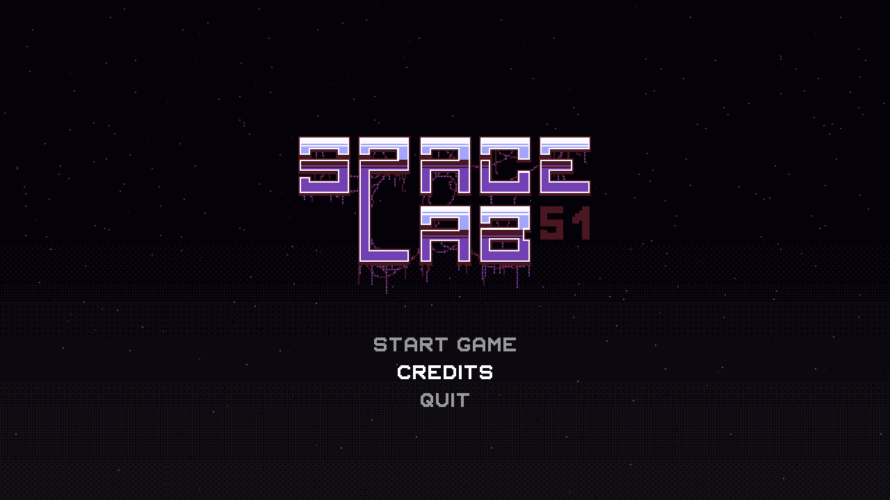
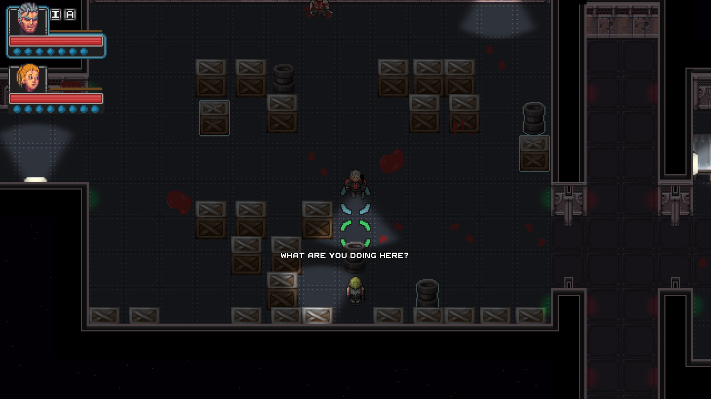
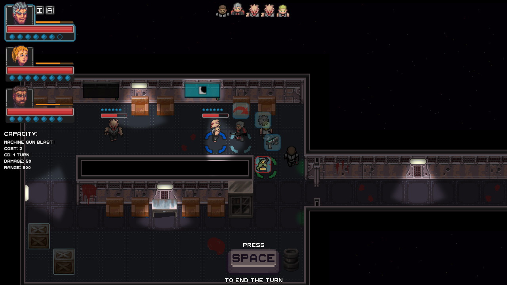

# Space Lab 51

## Description
Space Lab 51 is a tactical sci-fi RPG developed for the PSITE Region III
game development competition in the Philippines, where it won the 1st place.

The game was developed in Java and LWJGL. The map of the game was made using [Mithril Pants Map Editor]()
It was made in a few days therefore a lot of code is not optimized and
not so good practice.

## Credits
### Team
* Hanksha (Caldera Games) - programming & graphic assets
* Yukishi (Caldera Games) - graphic assets
* Tres - animations

#### Sprites
Most graphic assets are original, some of them are derived or inspired
from assets found on http://opengameart.org/.

#### Music
* Ossuary 2 Turn - http://incompetech.com
* Ossuary 4 Animate - http://incompetech.com
* Mechanolith - http://incompetech.com

#### Sound effects
All the sound effects are from http://soundbible.com

## Screenshots

## License
This project is under the GNU GENERAL PUBLIC LICENSE Version 3, you can read the
full text of the license [here](LICENSE.md). You are free to continue developing
this game or improve it.
